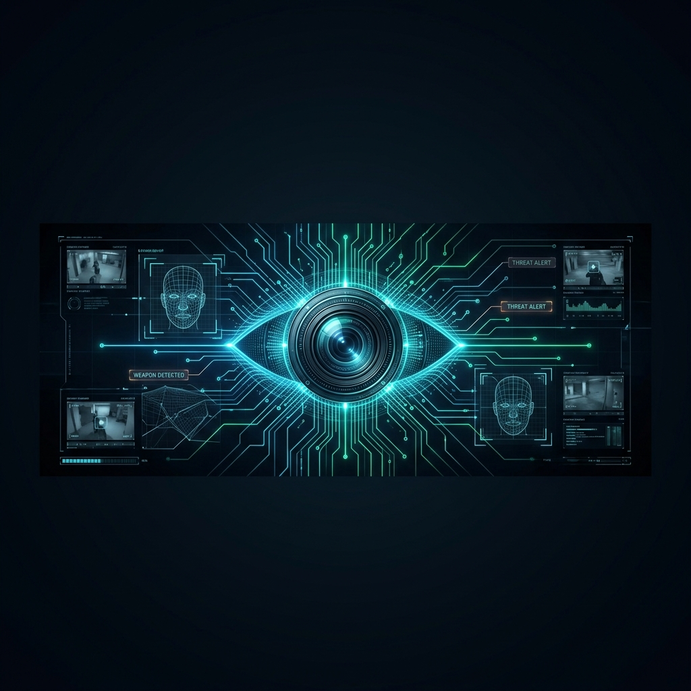
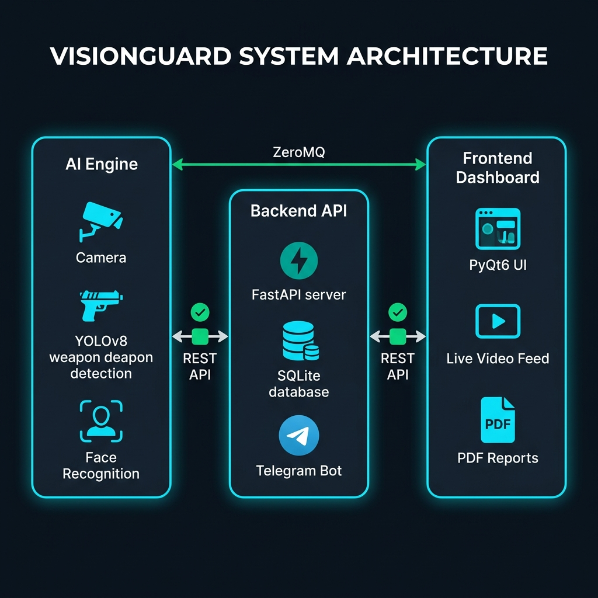

<p align="center">
  
</p>

<h1 align="center">🛡️ VisionGuard — AI-Powered Security Surveillance System</h1>

<p align="center">
  <strong>Real-time threat detection, facial recognition, and intelligent security monitoring — all in one platform.</strong>
</p>

<p align="center">
  
  
  
  
  
  
</p>

<p align="center">
  
  
  
  
</p>

---

## 📋 Table of Contents

- [Overview](#-overview)
- [Key Features](#-key-features)
- [System Architecture](#-system-architecture)
- [Tech Stack](#-tech-stack)
- [Project Structure](#-project-structure)
- [Prerequisites](#-prerequisites)
- [Installation](#-installation)
- [Configuration](#-configuration)
- [Usage](#-usage)
- [API Reference](#-api-reference)
- [Security Modules](#-security-modules)
- [PDF Reports](#-pdf-reports)
- [Contributing](#-contributing)
- [Team](#-team)
- [License](#-license)

---

## 🔭 Overview

**VisionGuard** is an enterprise-grade, AI-powered security surveillance platform built for real-time threat detection and access control. It combines state-of-the-art deep learning models (YOLOv8 for object/weapon detection and dlib-based face recognition) with a modern PyQt6 dashboard and a FastAPI backend — all working in concert to deliver sub-second threat response times.

The system is designed for deployment in high-security environments such as corporate offices, government buildings, and restricted-access facilities.

### 🎯 What Problem Does It Solve?

| Traditional CCTV | VisionGuard AI |
|---|---|
| ❌ Passive recording only | ✅ Active real-time threat detection |
| ❌ Requires human monitoring 24/7 | ✅ Fully autonomous AI analysis |
| ❌ Alerts after incidents | ✅ Instant alerts via Telegram with evidence |
| ❌ No access control integration | ✅ Built-in facial recognition & authorization |
| ❌ No structured reporting | ✅ Automated PDF security reports |

---

## ✨ Key Features

### 🔫 Weapon Detection (YOLOv8)
- **Custom-trained model** (`pistol.pt`) for firearm detection with **73% confidence threshold**
- **Knife detection** via YOLOv8s with configurable confidence (35% default)
- Real-time bounding box overlays with threat classification
- **Continuous audible alarm** when a weapon is detected

### 👤 Facial Recognition & Access Control
- **dlib + face_recognition** pipeline for real-time face matching
- Pre-enrolled trusted personnel database with per-person photo folders
- **Three-tier classification:**
  - 🟢 `AUTHORIZED` — Known person during working hours
  - 🟡 `UNAUTHORIZED` — Unknown person detected
  - 🔴 `AFTER-HOURS INTRUSION` — Any person outside configured work hours
- Configurable face matching tolerance (default: 0.52)

### 📡 Real-Time Video Streaming
- **ZeroMQ (PUB/SUB)** architecture for ultra-low-latency frame delivery
- 1080p @ 30 FPS input → JPEG-encoded stream @ ~60 FPS to UI
- HUD-style bounding boxes with corner accents and color-coded labels
- Flashing **CRITICAL THREAT DETECTED** overlay during active threats

### 📊 Enterprise Dashboard (PyQt6)
- Dark-themed, premium UI with military-grade aesthetics
- **Three main pages:** Live Dashboard, Event Logs, Incident Reports
- Real-time status indicators, pulsing REC dot, and live clock
- Trusted personnel panel with avatar display
- One-click snapshot capture from live feed

### 🤖 Telegram Bot Alerts
- Instant photo alerts sent to configured Telegram chat
- Includes threat type, timestamp, and annotated evidence frame
- Triggered on weapon detection and after-hours intrusion

### 📑 PDF Report Generation
- Automated security reports (Hourly / Daily / Weekly / Monthly)
- Categorized sections: Authorized, Unauthorized, Threats, After-Hours
- Session tracking with duration and timestamps
- Export directly from the dashboard UI

### 🎒 Object Tracking
- Bag detection (backpacks & handbags) for suspicious package monitoring
- Session-based tracking with unique UUIDs per detection event
- Automatic session expiry after 5 seconds of non-detection

---

## 🏗️ System Architecture

<p align="center">
  
</p>

```
┌─────────────────────────────────────────────────────────────────┐
│                        VisionGuard System                       │
├──────────────┬──────────────────────┬───────────────────────────┤
│  AI Engine   │    Backend API       │    Frontend Dashboard     │
│              │                      │                           │
│ ┌──────────┐ │ ┌──────────────────┐ │ ┌───────────────────────┐ │
│ │ Camera   │ │ │ FastAPI Server   │ │ │ PyQt6 Desktop App     │ │
│ │ 1080p    │ │ │ (Port 8000)      │ │ │                       │ │
│ └────┬─────┘ │ └───────┬──────────┘ │ │ ┌───────────────────┐ │ │
│      │       │         │            │ │ │ Live 1080p Feed   │ │ │
│ ┌────▼─────┐ │ ┌───────▼──────────┐ │ │ │ (ZeroMQ Sub)      │ │ │
│ │ YOLOv8   │──▶│ SQLite Database   │ │ │ └───────────────────┘ │ │
│ │ Detector │ │ │ + Session Cache   │ │ │ ┌───────────────────┐ │ │
│ └────┬─────┘ │ └───────┬──────────┘ │ │ │ Event Logs Page   │ │ │
│      │       │         │            │ │ └───────────────────┘ │ │
│ ┌────▼─────┐ │ ┌───────▼──────────┐ │ │ ┌───────────────────┐ │ │
│ │ Face     │──▶│ Telegram Bot      │ │ │ │ PDF Reports       │ │ │
│ │ Recog.   │ │ │ (Photo Alerts)    │ │ │ └───────────────────┘ │ │
│ └──────────┘ │ └──────────────────┘ │ └───────────────────────┘ │
│       │      │                      │           ▲               │
│       └──────┼──────────────────────┼───────────┘               │
│    ZeroMQ    │     REST API         │    ZeroMQ + REST API      │
│  (tcp:5555)  │   (http:8000)        │                           │
└──────────────┴──────────────────────┴───────────────────────────┘
```

### Data Flow

1. **Camera** → captures 1080p frames at 30 FPS
2. **AI Engine** → runs YOLOv8 (weapon/object detection) and face recognition in parallel threads
3. **ZeroMQ** → broadcasts annotated frames to the frontend at ~60 FPS
4. **Backend API** → receives threat alerts, access logs, and session data via REST
5. **SQLite** → persists all security events with timestamps and evidence images
6. **Telegram** → sends instant photo alerts for critical threats
7. **Dashboard** → displays everything in real-time with filtering and PDF export

---

## 🛠️ Tech Stack

| Layer | Technology | Purpose |
|-------|-----------|---------|
| **AI / ML** | YOLOv8 (Ultralytics), dlib, face_recognition | Object detection & facial recognition |
| **Backend** | FastAPI, SQLAlchemy, SQLite | REST API & data persistence |
| **Frontend** | PyQt6 | Desktop dashboard UI |
| **Streaming** | ZeroMQ (pyzmq) | Ultra-low-latency video transport |
| **Notifications** | Telegram Bot API | Instant threat alerts |
| **Computer Vision** | OpenCV (cv2) | Frame capture, encoding, image processing |
| **GPU Acceleration** | CUDA 12.4 + PyTorch | Real-time inference acceleration |
| **Reports** | QPdfWriter (Qt) | Automated PDF report generation |

---

## 📁 Project Structure

```
Vision Guard 2/
│
├── 🤖 ai_engine/                    # AI Processing Module
│   ├── main.py                      # Engine entry point & ZeroMQ broadcaster
│   ├── workers.py                   # Camera, YOLO, and Face Recognition threads
│   ├── config.py                    # AI thresholds & server configuration
│   ├── state.py                     # Thread-safe shared state & locks
│   ├── utils.py                     # Drawing utilities & API communication
│   ├── pistol.pt                    # Custom-trained weapon detection model
│   ├── yolov8n.pt                   # YOLOv8 Nano model
│   ├── yolov8s.pt                   # YOLOv8 Small model (knife/bag detection)
│   └── faces/                       # Enrolled personnel face images
│       ├── Nourullah/
│       ├── osama/
│       ├── vael/
│       └── Mohamad/
│
├── 🌐 backend_api/                  # Backend Server Module
│   ├── main_server.py               # FastAPI server with all endpoints
│   ├── database.py                  # SQLAlchemy engine & session factory
│   ├── models.py                    # ORM models (ThreatLog, FaceLog, SnapshotLog)
│   ├── telegram_bot.py              # Telegram alert integration
│   └── static/                      # Stored alert images & snapshots
│       ├── alerts/
│       └── snapshots/
│
├── 🖥️ frontend_ui/                  # Desktop Dashboard Module
│   ├── main_dashboard.py            # PyQt6 main application window
│   ├── styles.py                    # UI color palette & stylesheet definitions
│   ├── network_workers.py           # ZeroMQ receiver & API polling threads
│   ├── report_generator.py          # PDF report generation engine
│   ├── faces/                       # Personnel avatars for dashboard display
│   └── reports/                     # Generated PDF reports output
│
├── 📦 assets/                       # Project assets (banner, diagrams)
├── 📜 Start_VisionGuard.bat         # One-click launcher for all modules
└── 📖 README.md                     # This file
```

---

## ⚙️ Prerequisites

| Requirement | Version | Notes |
|------------|---------|-------|
| **Python** | 3.11+ | Required for all modules |
| **NVIDIA GPU** | CUDA-capable | For real-time AI inference |
| **CUDA Toolkit** | 12.4 | Must be installed at default path |
| **Camera** | USB / HDMI Capture | 1080p capable, index configurable |
| **Windows** | 10 / 11 | Primary supported platform |
| **RAM** | 8 GB+ | 16 GB recommended |

---

## 🚀 Installation

### 1. Clone the Repository

```bash
git clone https://github.com/osama1mousa/Vision-Guard-Project.git
cd Vision-Guard-Project
```

### 2. Create Virtual Environment

```bash
python -m venv venv
venv\Scripts\activate
```

### 3. Install Dependencies

```bash
# Core dependencies
pip install ultralytics opencv-python pyzmq fastapi uvicorn sqlalchemy python-multipart requests

# Face recognition (requires dlib)
pip install ai_engine/dlib-19.24.1-cp311-cp311-win_amd64.whl
pip install face_recognition

# Frontend
pip install PyQt6

# GPU acceleration (PyTorch with CUDA)
pip install torch torchvision --index-url https://download.pytorch.org/whl/cu124
```

### 4. Enroll Trusted Personnel

Add face images for authorized personnel:

```
ai_engine/faces/
├── PersonName1/
│   ├── photo1.jpg
│   ├── photo2.jpg
│   └── ...
├── PersonName2/
│   └── photo1.jpg
└── ...
```

> **💡 Tip:** Use multiple photos per person from different angles for better recognition accuracy.

### 5. Configure the System

Edit `ai_engine/config.py` to match your environment:

```python
SERVER_IP = "YOUR_SERVER_IP"    # Backend server IP address
SERVER_PORT = "8000"             # Backend server port

CONF_PISTOL = 0.73               # Weapon detection confidence
CONF_KNIFE = 0.35                # Knife detection confidence
CONF_BAG = 0.60                  # Bag detection confidence
FACE_TOLERANCE = 0.52            # Face matching tolerance (lower = stricter)

WORK_START_HOUR = 8              # Working hours start
WORK_END_HOUR = 23               # Working hours end
```

---

## 🎮 Usage

### One-Click Launch

Double-click `Start_VisionGuard.bat` to launch all three modules simultaneously:

```
[1] Backend Server (FastAPI + SQLite)     → Port 8000
[2] AI Engine (YOLO + Face Recognition)   → ZeroMQ on port 5555
[3] Frontend Dashboard (PyQt6 UI)         → Desktop window
```

### Manual Launch (Recommended for Development)

Open three separate terminals:

```bash
# Terminal 1 — Backend Server
cd backend_api
python main_server.py

# Terminal 2 — AI Engine
cd ai_engine
python main.py

# Terminal 3 — Frontend Dashboard
cd frontend_ui
python main_dashboard.py
```

> ⚠️ **Important:** Start the Backend Server first, then the AI Engine, then the Dashboard.

---

## 📡 API Reference

The backend exposes a RESTful API on `http://<SERVER_IP>:8000`:

| Method | Endpoint | Description |
|--------|----------|-------------|
| `POST` | `/api/log_threat` | Log a threat event with evidence image |
| `POST` | `/api/log_access` | Log authorized personnel access |
| `POST` | `/api/snapshot` | Save a manual snapshot from the dashboard |
| `GET`  | `/api/alerts` | Retrieve recent security events (paginated) |
| `POST` | `/api/log_structured_item` | Log/update a session-tracked event |
| `GET`  | `/api/structured_logs` | Retrieve all structured session logs |
| `GET`  | `/api/generate_report` | Generate a PDF report (`?period=daily`) |

### Example — Log a Threat

```bash
curl -X POST http://localhost:8000/api/log_threat \
  -F "threat_type=WEAPON" \
  -F "file=@alert_frame.jpg"
```

### Example — Get Recent Alerts

```bash
curl http://localhost:8000/api/alerts
```

---

## 🔒 Security Modules

### Threat Detection Pipeline

```
Frame Captured (1080p)
    │
    ├─→ YOLOv8 Custom Model (pistol.pt)  →  WEAPON alert
    │       Confidence ≥ 73%
    │
    ├─→ YOLOv8s General Model
    │   ├─→ Knife Detection              →  WEAPON alert
    │   │       Confidence ≥ 35%
    │   └─→ Bag Detection                →  BAG tracking
    │           Confidence ≥ 60%
    │
    └─→ Face Recognition (dlib + HOG)
        ├─→ Known + Working Hours         →  AUTHORIZED ✅
        ├─→ Known + After Hours           →  THREAT 🔴
        ├─→ Unknown + Working Hours       →  UNAUTHORIZED ⚠️
        └─→ Unknown + After Hours         →  INTRUSION 🔴
```

### Session Tracking

Each detected entity (person, weapon, bag) is assigned a **unique UUID session**. Sessions track:
- **Start time** — when the entity first appeared
- **End time** — when it was last seen
- **Duration** — total time in frame
- **Category** — AUTHORIZED / UNAUTHORIZED / THREAT / AFTER_HOURS

Sessions expire after **5 seconds** of non-detection.

---

## 📑 PDF Reports

Reports are generated directly from the dashboard and categorized into four sections:

| Section | Color Code | Description |
|---------|-----------|-------------|
| ✅ Authorized Personnel | 🟢 Green | Verified access entries with duration |
| ⚠️ Unauthorized Access | 🟠 Orange | Unknown persons detected |
| 🔴 Threat Detections | 🔴 Red | Weapon / knife detections with evidence |
| 🟣 After-Hours Activity | 🟣 Purple | Out-of-hours intrusion attempts |

Reports can be filtered by time period: **Hourly**, **Daily**, **Weekly**, or **Monthly**.

Output location: `frontend_ui/reports/`

---

## 🤝 Contributing

Contributions are welcome! Here's how to get started:

1. **Fork** the repository
2. Create a **feature branch**: `git checkout -b feature/amazing-feature`
3. **Commit** your changes: `git commit -m "Add amazing feature"`
4. **Push** to the branch: `git push origin feature/amazing-feature`
5. Open a **Pull Request**

### Development Guidelines

- Follow PEP 8 style guidelines
- Add docstrings to new functions
- Test with both GPU and CPU modes
- Update this README for any new features

---

## 👥 Team

<table>
  <tr>
    <td align="center"><strong>Osama</strong><br/>Project Lead</td>
    <td align="center"><strong>Nourullah</strong><br/>Team Member</td>
    <td align="center"><strong>Vael</strong><br/>Team Member</td>
    <td align="center"><strong>Mohamad</strong><br/>Team Member</td>
  </tr>
</table>

---

## 📄 License

This project is licensed under the **MIT License** — see the [LICENSE](LICENSE) file for details.

---

<p align="center">
  
</p>

<p align="center">
  <strong>VisionGuard</strong> — <em>Because security should never sleep.</em>
</p>
